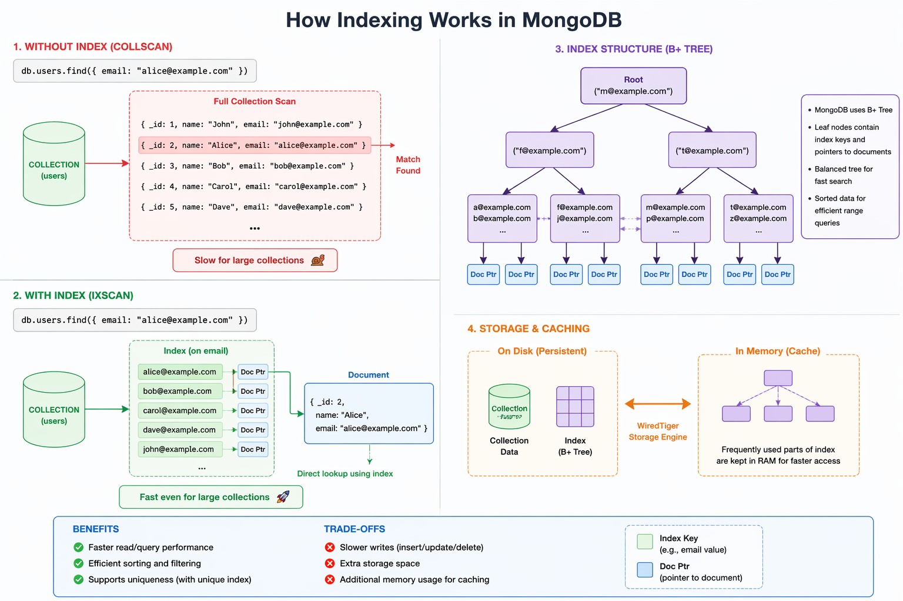

# 🗂️ MongoDB Indexing — In-Depth Guide

> **Indexing in MongoDB** is a way to organize data in a collection so that queries can be executed faster.
> Think of it like a book index 📖 — instead of reading the whole book, you jump directly to the page you need.

---

## 📌 Table of Contents

- [What is Indexing?](#-what-is-indexing)
- [How It Works Internally](#-how-it-works-internally)
- [Without Index vs With Index](#-without-index-collscan-vs-with-index-ixscan)
- [explain() — Analyze Query Performance](#-explain--analyze-query-performance)
- [Get Existing Indexes](#-get-existing-indexes)
- [Single Field Index](#-single-field-index)
- [Compound Index](#-compound-index)
- [TTL Index — Auto Delete Records](#-ttl-index--auto-delete-records)
- [Unique Index](#-unique-index)
- [Unique Compound Index](#-unique-compound-index)
- [Dropping Indexes](#-dropping-indexes)
- [Benefits vs Trade-offs](#-benefits-vs-trade-offs)
- [Index Type Cheat Sheet](#-index-type-cheat-sheet)

---

## 🤔 What is Indexing?

Without an index, MongoDB performs a **Collection Scan (COLLSCAN)** — it reads **every single document** to find a match. This is extremely slow for large datasets.

With an index, MongoDB performs an **Index Scan (IXSCAN)** — it looks up the index (like a book index) and jumps directly to the matching document. This is **orders of magnitude faster**.

```
👉 Without an index → MongoDB scans every document (collection scan)
👉 With an index    → MongoDB quickly finds matching documents via B+ Tree
```

---

## 🔬 How It Works Internally



MongoDB uses a **B+ Tree** data structure to store index entries. Here's why:

| Property | Why It Matters |
|---|---|
| **Balanced Tree** | Guarantees O(log n) lookup regardless of data size |
| **Leaf nodes hold index keys + document pointers** | Direct access without full scan |
| **Sorted data** | Efficient range queries (`$gt`, `$lt`, `$between`) |
| **Linked leaf nodes** | Fast in-order traversal for sorting |

### Storage & Caching

MongoDB uses the **WiredTiger** storage engine:

- **On Disk (Persistent):** Collection data and B+ Tree indexes are persisted to disk.
- **In Memory (Cache):** Frequently used parts of the index are cached in RAM for even faster access.

---

## 🔴 Without Index (COLLSCAN) vs 🟢 With Index (IXSCAN)

### ❌ Without Index — Full Collection Scan

```js
// This query, without an index, scans ALL documents
db.users.find({ email: "alice@example.com" })

// MongoDB reads every document one by one:
// { _id: 1, name: "John",  email: "john@example.com"  }  ← skip
// { _id: 2, name: "Alice", email: "alice@example.com" }  ← MATCH FOUND ✅
// { _id: 3, name: "Bob",   email: "bob@example.com"   }  ← skip (still reads!)
// { _id: 4, name: "Carol", email: "carol@example.com" }  ← skip (still reads!)
// { _id: 5, name: "Dave",  email: "dave@example.com"  }  ← skip (still reads!)
//  ... continues for EVERY document in the collection
```

> 🐢 **Slow for large collections.** If you have 10 million documents, it reads all 10 million.

---

### ✅ With Index — Direct Lookup (IXSCAN)

```js
// Same query, but NOW with an index on `email`
db.users.find({ email: "alice@example.com" })

// MongoDB uses the B+ Tree index to jump directly:
// Index lookup: "alice@example.com" → Doc Pointer → { _id: 2, name: "Alice", ... }
// Done. ✅ No other documents touched.
```

> 🚀 **Fast even for large collections.** Whether you have 100 or 100 million documents, it finds the result in O(log n) time.

---

## 🔍 `explain()` — Analyze Query Performance

`explain("executionStats")` reveals **how** MongoDB executed your query — whether it used an index or did a full scan.

```js
db.CustomerLarge.find({ email: "joe.steuber@hotmail.com" }).explain("executionStats")
```

### Key fields to look for in the output:

```json
{
  "queryPlanner": {
    "winningPlan": {
      "stage": "IXSCAN",         // ✅ Good — index scan used
      // "stage": "COLLSCAN"     // ❌ Bad — full collection scan
      "indexName": "email_1"
    }
  },
  "executionStats": {
    "nReturned": 1,              // Documents returned
    "totalDocsExamined": 1,      // ✅ Should equal nReturned with a good index
    "totalKeysExamined": 1,      // Index keys scanned
    "executionTimeMillis": 0     // Query time in ms
  }
}
```

> 💡 **Rule of thumb:** `totalDocsExamined` should equal `nReturned`. If it's much higher, you need a better index.

---

## 📋 Get Existing Indexes

```js
db.CustomerLarge.getIndexes()
```

**Sample output:**
```json
[
  {
    "v": 2,
    "key": { "_id": 1 },
    "name": "_id_"
  },
  {
    "v": 2,
    "key": { "email": 1 },
    "name": "email_1"
  }
]
```

> 📌 MongoDB **always** creates a default index on `_id`. You cannot drop it.

---

## 🏗️ Single Field Index

Index a single field to speed up queries that filter or sort by that field.

```js
// Create an ascending index on the `email` field
db.CustomerLarge.createIndex({ email: 1 })

// 1  = ascending order
// -1 = descending order
```

**When to use:**
- You frequently query by a single field (e.g., `email`, `username`, `phone`)
- You sort results by a single field
- You enforce uniqueness on one field (see Unique Index)

**Example query that benefits:**
```js
db.CustomerLarge.find({ email: "joe.steuber@hotmail.com" })
// Now uses IXSCAN instead of COLLSCAN ✅
```

---

## 🔗 Compound Index

Index **multiple fields together** in a single index. The **order of fields matters**.

```js
// Create a compound index on email (ascending) + age (ascending)
db.CustomerLarge.createIndex({ email: 1, age: 1 })
```

### The ESR Rule (Best Practice)

For compound indexes, order fields following the **ESR rule**:

```
E → Equality fields first   (fields used with exact match: { email: "..." })
S → Sort fields next        (fields used in .sort())
R → Range fields last       (fields used with $gt, $lt, $in, etc.)
```

**Example:**
```js
// Query: find users by email (equality), sort by name, filter age range
db.CustomerLarge.find({ email: "joe@example.com", age: { $gt: 25 } }).sort({ name: 1 })

// Optimal compound index following ESR:
db.CustomerLarge.createIndex({ email: 1, name: 1, age: 1 })
```

### Prefix Rule — One Index, Multiple Queries

A compound index `{ email: 1, age: 1 }` also supports queries on just `email`:

```js
db.CustomerLarge.find({ email: "joe@example.com" })         // ✅ Uses index
db.CustomerLarge.find({ email: "joe@example.com", age: 30 }) // ✅ Uses index
db.CustomerLarge.find({ age: 30 })                           // ❌ Does NOT use index (skipped prefix)
```

> ⚠️ **You cannot skip the prefix.** A query on `{ age: 30 }` alone will NOT use the `{ email: 1, age: 1 }` index.

---

## ⏳ TTL Index — Auto Delete Records

**TTL (Time-To-Live)** indexes automatically delete documents after a specified duration. Perfect for OTPs, sessions, logs, or any temporary data.

```js
// Auto-delete documents 7 days (604800 seconds) after `createdAt`
db.CustomerOtp.createIndex(
  { createdAt: 1 },
  { expireAfterSeconds: 604800 }
)
```

### How TTL Works

```
Document inserted with createdAt: 2024-01-01T10:00:00Z
TTL: 604800 seconds (7 days)
Auto-deleted at: 2024-01-08T10:00:00Z  ← MongoDB removes this automatically
```

**Important rules:**
- The field **must be a `Date` type** (not a string or timestamp number)
- MongoDB's background task runs every **60 seconds** — deletion is not instantaneous to the second
- TTL indexes only work on **single fields**, not compound indexes

**Inserting a document with TTL:**
```js
db.CustomerOtp.insertOne({
  userId: ObjectId("..."),
  otp: "482910",
  createdAt: new Date()   // ← Must be a Date object
})
// This document will be auto-deleted after 7 days ✅
```

**Common `expireAfterSeconds` values:**
```js
{ expireAfterSeconds: 300 }      // 5 minutes   — OTP codes
{ expireAfterSeconds: 3600 }     // 1 hour      — temporary tokens
{ expireAfterSeconds: 86400 }    // 1 day       — daily cache
{ expireAfterSeconds: 604800 }   // 7 days      — weekly session
{ expireAfterSeconds: 2592000 }  // 30 days     — monthly logs
```

---

## 🔒 Unique Index

Enforce that **no two documents** can have the same value for an indexed field. MongoDB will reject duplicate inserts.

```js
// Ensure all emails are unique across the Customers collection
db.Customers.createIndex(
  { email: 1 },
  { unique: true }
)
```

**What happens on duplicate insert:**
```js
db.Customers.insertOne({ name: "Alice", email: "alice@example.com" }) // ✅ OK
db.Customers.insertOne({ name: "Bob",   email: "alice@example.com" }) // ❌ ERROR!

// MongoServerError: E11000 duplicate key error collection: db.Customers
// index: email_1 dup key: { email: "alice@example.com" }
```

> 📌 MongoDB's `_id` field is automatically a unique index. The unique constraint works even without an explicit index — but adding `{ unique: true }` to your own fields enforces business rules at the database level.

---

## 🔑 Unique Compound Index

Enforce uniqueness on a **combination of fields** — the pair must be unique, not each field individually.

```js
// The COMBINATION of email + name must be unique
db.Customers.createIndex(
  { email: 1, name: 1 },
  { unique: true }
)
```

**Behavior example:**
```js
db.Customers.insertOne({ email: "alice@example.com", name: "Alice" })  // ✅ OK
db.Customers.insertOne({ email: "alice@example.com", name: "Bob" })    // ✅ OK (different name)
db.Customers.insertOne({ email: "alice@example.com", name: "Alice" })  // ❌ ERROR — exact pair exists!
```

**Real-world use cases:**
- A user can have multiple addresses, but the same address type only once: `{ userId: 1, addressType: 1 }`
- Prevent the same user from rating the same product twice: `{ userId: 1, productId: 1 }`
- No duplicate event registrations: `{ userId: 1, eventId: 1 }`

---

## 🗑️ Dropping Indexes

### Drop a Specific Index by Name

```js
// Drop the compound index named "email_1_age_1"
db.CustomerLarge.dropIndex("email_1_age_1")
```

> 💡 The index name is auto-generated as `fieldName_direction` joined by `_`.
> `{ email: 1, age: 1 }` → name is `email_1_age_1`

### Drop All Indexes (Except `_id`)

```js
// ⚠️ This drops ALL indexes except the default _id index
db.CustomerLarge.dropIndexes()
```

### Find the Index Name First

```js
// Step 1: List all indexes to find the name
db.CustomerLarge.getIndexes()

// Step 2: Drop by name
db.CustomerLarge.dropIndex("email_1_age_1")
```

> ⚠️ **Warning:** Dropping an index on a production collection will cause queries that relied on it to fall back to COLLSCAN until you recreate it. Do this during low-traffic windows.

---

## ⚖️ Benefits vs Trade-offs

### ✅ Benefits

| Benefit | Description |
|---|---|
| 🚀 **Faster reads** | Queries run in O(log n) instead of O(n) |
| 🔍 **Efficient sorting** | Avoid in-memory sorts on large result sets |
| 📊 **Range queries** | Fast `$gt`, `$lt`, `$between` operations |
| 🔒 **Uniqueness enforcement** | Prevent duplicate data at the DB level |
| ⚡ **Reduced server load** | Less CPU and I/O for queries |

### ❌ Trade-offs

| Trade-off | Description |
|---|---|
| 🐢 **Slower writes** | Every `insert`, `update`, `delete` must also update the index |
| 💾 **Extra storage** | Indexes consume additional disk space |
| 🧠 **Memory usage** | Indexes are cached in RAM (WiredTiger buffer pool) |
| 🔧 **Maintenance overhead** | Too many indexes can hurt write-heavy workloads |

> 💡 **Rule of thumb:** Index the fields you **query and sort by most often**. Avoid indexing every field — each index has a write cost.

---

## 📊 Index Type Cheat Sheet

| Index Type | Command | Use Case |
|---|---|---|
| **Single Field** | `createIndex({ email: 1 })` | Query/sort by one field |
| **Compound** | `createIndex({ email: 1, age: 1 })` | Query/sort by multiple fields |
| **Unique** | `createIndex({ email: 1 }, { unique: true })` | Prevent duplicate values |
| **Unique Compound** | `createIndex({ email: 1, name: 1 }, { unique: true })` | Prevent duplicate field combos |
| **TTL** | `createIndex({ createdAt: 1 }, { expireAfterSeconds: N })` | Auto-expire documents |
| **Text** | `createIndex({ bio: "text" })` | Full-text search |
| **Geospatial** | `createIndex({ location: "2dsphere" })` | Location-based queries |
| **Hashed** | `createIndex({ userId: "hashed" })` | Sharding / equality lookups |

---

## 🧪 Quick Reference — All Commands

```js
// ── Inspect ──────────────────────────────────────────────────────────────────
db.CustomerLarge.getIndexes()                    // List all indexes
db.CustomerLarge.find({...}).explain("executionStats") // Analyze query plan

// ── Create ───────────────────────────────────────────────────────────────────
db.CustomerLarge.createIndex({ email: 1 })                              // Single field
db.CustomerLarge.createIndex({ email: 1, age: 1 })                     // Compound
db.CustomerOtp.createIndex({ createdAt: 1 }, { expireAfterSeconds: 604800 }) // TTL
db.Customers.createIndex({ email: 1 }, { unique: true })               // Unique
db.Customers.createIndex({ email: 1, name: 1 }, { unique: true })      // Unique compound

// ── Drop ─────────────────────────────────────────────────────────────────────
db.CustomerLarge.dropIndex("email_1_age_1")      // Drop specific index by name
db.CustomerLarge.dropIndexes()                   // Drop all indexes (except _id)
```

---

## 📚 Further Reading

- [MongoDB Official Indexing Docs](https://www.mongodb.com/docs/manual/indexes/)
- [Query Optimization with explain()](https://www.mongodb.com/docs/manual/tutorial/analyze-query-plan/)
- [ESR Rule for Compound Indexes](https://www.mongodb.com/docs/manual/tutorial/create-indexes-to-support-queries/)
- [TTL Indexes](https://www.mongodb.com/docs/manual/core/index-ttl/)

---

<div align="center">

Made with ❤️ for MongoDB developers

</div>
