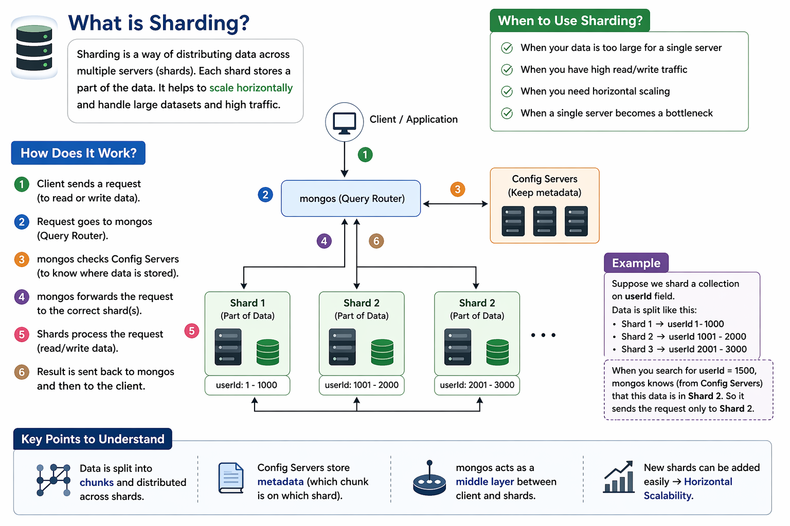

# Database Sharding Guide 📊

A comprehensive guide to understanding database sharding, its implementation, and best practices.

## 📖 Table of Contents

- [What is Sharding?](#what-is-sharding)
- [How Does It Work?](#how-does-it-work)
- [When to Use Sharding?](#when-to-use-sharding)
- [Key Concepts](#key-concepts)
- [Sharding Strategies](#sharding-strategies)
- [Advantages & Disadvantages](#advantages--disadvantages)
- [Best Practices](#best-practices)
- [Example Implementation](#example-implementation)

---

## What is Sharding?

Sharding is a **database partitioning technique** that distributes data across multiple servers (called **shards**). Each shard holds a subset of the data, enabling horizontal scaling and improved performance for large-scale applications.

### Core Concept

```
┌─────────────────────────────────────────────────────┐
│              Single Large Database                   │
│     (Performance bottleneck, limited scale)          │
└─────────────────────────────────────────────────────┘
                            ⬇️
┌──────────────┬──────────────┬──────────────┐
│   Shard 1    │   Shard 2    │   Shard 3    │
│  (Data A-I)  │  (Data J-R)  │  (Data S-Z)  │
└──────────────┴──────────────┴──────────────┘
```

---

## How Does It Work?



### Step-by-Step Process

**1️⃣ Client Request**
- Client application sends a read/write request

**2️⃣ Query Router**
- Request reaches the query router (e.g., mongos in MongoDB)

**3️⃣ Metadata Lookup**
- Query router checks configuration servers to determine which shard holds the data

**4️⃣ Route to Correct Shard**
- Router forwards the request to the appropriate shard(s)

**5️⃣ Process Request**
- The shard processes the read/write operation

**6️⃣ Return Result**
- Result is sent back through the query router to the client

---

## When to Use Sharding?

Implement sharding when you encounter:

✅ **Data Too Large for Single Server**
- Your dataset exceeds the storage capacity of one machine

✅ **High Read/Write Traffic**
- Single server becomes a bottleneck due to throughput limitations

✅ **Need for Horizontal Scaling**
- Vertical scaling (bigger hardware) is insufficient or cost-prohibitive

✅ **Single Server Bottleneck**
- Performance degrades significantly on a single instance

✅ **Geographic Distribution**
- Need to serve data closer to users in different regions

---

## Key Concepts

### 1. **Shards** 🔀
- Individual database instances that store a subset of data
- Each shard is independent and self-contained
- Can be replicated for high availability

### 2. **Shard Key** 🔑
- The field used to determine which shard a record belongs to
- Must be chosen carefully (immutable, evenly distributed)
- Examples: `userId`, `customerId`, `region`

### 3. **Config Servers** 📋
- Store metadata about which data resides on which shard
- Keep track of shard ranges and distribution
- Essential for query routing

### 4. **Query Router** 🔗
- Acts as middleware between application and shards
- Reads config servers to route requests correctly
- Examples: mongos (MongoDB), ProxySQL

### 5. **Metadata** 📝
- Information about shard distribution
- Shard key ranges
- Shard locations and status

---

## Sharding Strategies

### 1. **Range-Based Sharding** 📈
```
Shard 1: userId 1 - 1000
Shard 2: userId 1001 - 2000
Shard 3: userId 2001 - 3000
```
**Pros:** Simple to implement, easy to understand
**Cons:** Can lead to uneven data distribution

### 2. **Hash-Based Sharding** #️⃣
```
hash(userId) % numShards = shard_id
```
**Pros:** Even distribution, prevents hot spots
**Cons:** Adding new shards requires rebalancing

### 3. **Directory-Based Sharding** 📚
```
Directory service maps key → shard_id
Provides flexibility and rebalancing capability
```
**Pros:** Flexible, easy to rebalance
**Cons:** Directory becomes a single point of failure

### 4. **Geographic Sharding** 🌍
```
Shard 1: Asia region data
Shard 2: Europe region data
Shard 3: Americas region data
```
**Pros:** Reduced latency, data locality compliance
**Cons:** Uneven distribution possible

---

## Advantages & Disadvantages

### ✅ Advantages

| Benefit | Description |
|---------|-------------|
| **Horizontal Scaling** | Add more shards to handle growth |
| **Improved Performance** | Distribute load across multiple servers |
| **Higher Availability** | Failure of one shard doesn't affect others |
| **Better Resource Utilization** | Optimal use of CPU, RAM, and I/O |
| **Geographic Distribution** | Serve data closer to users |

### ❌ Disadvantages

| Challenge | Description |
|-----------|-------------|
| **Operational Complexity** | More servers to manage and monitor |
| **Shard Key Dependency** | Poor key choice can cause uneven distribution |
| **Distributed Transactions** | Cross-shard transactions are difficult |
| **Rebalancing Challenges** | Moving data between shards is complex |
| **Joins Across Shards** | Queries spanning multiple shards are slow |
| **Hot Spots** | Popular data can overload a single shard |

---

## Best Practices

### 🎯 Choosing a Shard Key

```javascript
// ✅ GOOD: Even distribution, immutable
const shardKey = userId;  // Never changes

// ✅ GOOD: High cardinality (many unique values)
const shardKey = email;

// ❌ BAD: Low cardinality (few unique values)
const shardKey = isActive;  // Only true/false = 2 shards max

// ❌ BAD: Mutable (changes over time)
const shardKey = userLocation;  // Users move
```

### 📊 Monitoring & Maintenance

```bash
# Monitor shard distribution
- Check data size per shard
- Monitor query latency
- Track hot spots
- Set alerts for imbalanced shards
```

### 🔄 Rebalancing Strategy

```
1. Plan rebalancing during low-traffic windows
2. Use background rebalancing tools
3. Monitor impact on application performance
4. Have rollback plan ready
5. Test in staging first
```

### 🛡️ Handling Shard Failures

```
- Use replica sets per shard
- Implement automatic failover
- Maintain shard health checks
- Have disaster recovery plan
- Test failover procedures regularly
```

---

## Example Implementation

### MongoDB Sharding Example

```javascript
// 1. Enable sharding on database
db.adminCommand({ enableSharding: "myapp" });

// 2. Create index on shard key
db.users.createIndex({ userId: 1 });

// 3. Shard the collection
db.adminCommand({
  shardCollection: "myapp.users",
  key: { userId: 1 }
});

// 4. Define shard ranges (optional)
db.adminCommand({
  split: "myapp.users",
  middle: { userId: 500 }
});

// 5. Query example
// Router automatically routes to correct shard
db.users.findOne({ userId: 1500 });
// Result: Found in Shard 2 (userId 1001-2000)
```

### Python Implementation with Range-Based Sharding

```python
class ShardingRouter:
    def __init__(self, shard_servers, shard_ranges):
        self.shard_servers = shard_servers
        self.shard_ranges = shard_ranges
    
    def get_shard(self, user_id):
        """Determine which shard contains the user_id"""
        for shard_id, (start, end) in self.shard_ranges.items():
            if start <= user_id <= end:
                return self.shard_servers[shard_id]
        raise ValueError("User ID out of range")
    
    def insert_user(self, user_id, user_data):
        """Insert user into appropriate shard"""
        shard = self.get_shard(user_id)
        shard.insert_one({
            'userId': user_id,
            'data': user_data
        })
        return True
    
    def get_user(self, user_id):
        """Retrieve user from appropriate shard"""
        shard = self.get_shard(user_id)
        return shard.find_one({'userId': user_id})

# Usage
shard_ranges = {
    'shard_1': (1, 1000),
    'shard_2': (1001, 2000),
    'shard_3': (2001, 3000)
}

router = ShardingRouter(shard_servers, shard_ranges)
router.insert_user(1500, {'name': 'John', 'email': 'john@example.com'})
```

### Hash-Based Sharding in Python

```python
import hashlib

class HashShardingRouter:
    def __init__(self, num_shards):
        self.num_shards = num_shards
    
    def get_shard_id(self, key):
        """Use consistent hashing to determine shard"""
        hash_value = int(
            hashlib.md5(str(key).encode()).hexdigest(), 
            16
        )
        return hash_value % self.num_shards
    
    def route_query(self, user_id):
        """Route query to correct shard"""
        shard_id = self.get_shard_id(user_id)
        return f"Shard {shard_id}"

# Usage
router = HashShardingRouter(num_shards=3)
print(router.route_query(1500))  # Output: Shard 0
```

---

## Real-World Example

### Scenario: User Database with 100M Users

```
Without Sharding:
├─ Single Server: 500GB storage, CPU at 90%, queries slow
└─ Problem: Can't scale further

With Sharding (5 shards):
├─ Shard 1: 100GB, CPU 30%, fast queries ✓
├─ Shard 2: 100GB, CPU 30%, fast queries ✓
├─ Shard 3: 100GB, CPU 30%, fast queries ✓
├─ Shard 4: 100GB, CPU 30%, fast queries ✓
└─ Shard 5: 100GB, CPU 30%, fast queries ✓

Result: Better performance, easy to add more shards
```

---

## Common Pitfalls to Avoid

| ⚠️ Pitfall | Solution |
|-----------|----------|
| **Hot Shard** | Monitor distribution, choose better shard key |
| **Uneven Distribution** | Use hash-based sharding or directory-based approach |
| **Shard Key Selection** | Choose immutable, high-cardinality fields |
| **Cross-Shard Queries** | Denormalize data or use query routers |
| **Network Overhead** | Keep related data on same shard when possible |

---

## Tools & Technologies

### Databases with Built-in Sharding
- **MongoDB** - Excellent sharding support
- **Cassandra** - Distributed by design
- **DynamoDB** - AWS managed sharding
- **Elasticsearch** - Shard-based architecture
- **HBase** - Designed for sharding

### Sharding Tools & Proxies
- **mongos** - MongoDB query router
- **ProxySQL** - MySQL sharding proxy
- **Vitess** - MySQL middleware for sharding
- **Citus** - PostgreSQL distributed extension

---

## Resources

- [MongoDB Sharding Documentation](https://docs.mongodb.com/manual/sharding/)
- [MySQL Sharding Guide](https://dev.mysql.com/doc/)
- [Designing Data-Intensive Applications](https://dataintensive.fun/) - Martin Kleppmann
- [System Design Interview](https://www.systemdesigninterview.com/) - Alex Xu

---

## Contributing

Found improvements or have questions? Feel free to:
- Open an issue
- Submit a pull request
- Share feedback

---

## License

This guide is provided as-is for educational purposes.

---
