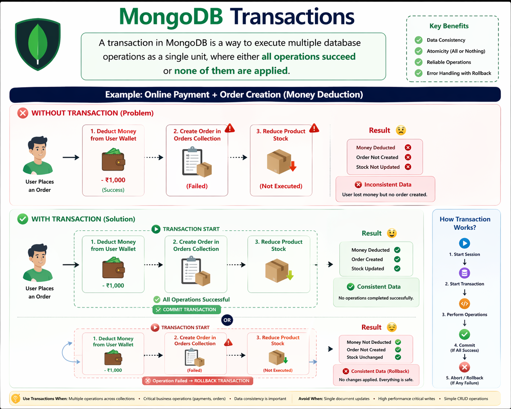

# MongoDB Transactions 🚀

A comprehensive guide to understanding and implementing transactions in MongoDB for reliable and consistent database operations.

---

## 📋 Table of Contents

- [Overview](#overview)
- [What is a Transaction?](#what-is-a-transaction)
- [Key Benefits](#key-benefits)
- [Transaction Architecture](#transaction-architecture)
- [Visual Guide](#visual-guide)
- [Real-World Example](#real-world-example)
- [ACID Properties](#acid-properties)
- [When to Use Transactions](#when-to-use-transactions)
- [When to Avoid Transactions](#when-to-avoid-transactions)
- [Code Examples](#code-examples)
- [Best Practices](#best-practices)
- [Common Pitfalls](#common-pitfalls)
- [Resources](#resources)

---

## Overview

MongoDB Transactions enable you to execute multiple database operations as a single atomic unit. With transactions, either **all operations succeed** or **none of them are applied**, ensuring data consistency and integrity across your database.

### Version Requirement
- **MongoDB 4.0+**: Single document transactions
- **MongoDB 4.2+**: Multi-document transactions with sharded clusters

---

## What is a Transaction?

A **transaction** in MongoDB is a way to execute multiple database operations as a single unit, where either:
- ✅ **All operations succeed** and are committed
- ❌ **All operations fail** and are rolled back

This prevents partial updates and maintains data consistency even if failures occur during the operation sequence.

### Key Definition
```
A transaction bundles multiple operations into a logical unit that ensures 
atomicity, consistency, isolation, and durability (ACID properties).
```

---

## Key Benefits

| Benefit | Description |
|---------|-------------|
| ✅ **Data Consistency** | Ensures all related data remains in a valid state |
| ✅ **Atomicity (All or Nothing)** | Either all operations complete or none do |
| ✅ **Reliable Operations** | Failed operations are automatically rolled back |
| ✅ **Error Handling with Rollback** | Automatic cleanup if any step fails |

---

## Transaction Architecture

### Components of a Transaction

```
┌─────────────────────────────────────────────────────┐
│           MongoDB Transaction Flow                   │
├─────────────────────────────────────────────────────┤
│  1. Start Session                                   │
│  2. Start Transaction                               │
│  3. Execute Operations                              │
│     - Debit Account                                 │
│     - Update Inventory                              │
│     - Create Order                                  │
│  4. Commit Transaction (if all succeed)             │
│  5. Rollback (if any operation fails)               │
└─────────────────────────────────────────────────────┘
```

### Transaction States

```
START_TRANSACTION
       ↓
   EXECUTING OPERATIONS
       ↓
    [Success?] ────→ Yes ──→ COMMIT ✅
       ↓
       No ──→ ROLLBACK ❌
```

---

## Visual Guide



This diagram illustrates:

### **WITHOUT Transaction (Problem) ❌**
When operations aren't wrapped in a transaction:
1. Money is deducted from user wallet ✅ (Success)
2. Creating order fails ❌ (Failed)
3. Stock reduction never executes ⚠️ (Not Executed)

**Result**: Inconsistent Data - User loses money but gets no order!

### **WITH Transaction (Solution) ✅**
All operations are bundled together:
1. Deduct Money from User Wallet
2. Create Order in Orders Collection
3. Reduce Product Stock

**If All Succeed**: COMMIT ✅ - All data is consistent
**If Any Fail**: ROLLBACK ❌ - Everything reverts, no data loss

---

## ACID Properties

MongoDB Transactions guarantee ACID compliance:

### **A - Atomicity**
```
"All or Nothing" principle
Either all operations execute or none do.
No partial updates allowed.
```

### **C - Consistency**
```
Data moves from one valid state to another.
Database rules and constraints are always maintained.
```

### **I - Isolation**
```
Concurrent transactions don't interfere with each other.
Each transaction operates independently until committed.
```

### **D - Durability**
```
Once committed, data persists permanently.
Protected against system failures and crashes.
```

---

## Real-World Example

### Scenario: Online Payment + Order Creation (Money Deduction)

#### ❌ WITHOUT TRANSACTION (Problem)

```javascript
// Scenario: User places order for ₹1,000

// Step 1: Deduct Money from Wallet (Success ✅)
db.users.updateOne(
  { _id: userId },
  { $inc: { wallet: -1000 } }
);
// Money deducted: -₹1,000

// Step 2: Create Order (Failed ❌)
db.orders.insertOne({
  userId: userId,
  amount: 1000,
  status: "pending"
});
// Something goes wrong here - Database error or timeout

// Step 3: Reduce Stock (Never Executes ⚠️)
db.products.updateOne(
  { _id: productId },
  { $inc: { stock: -1 } }
);
// This never runs

// ❌ RESULT: INCONSISTENT DATA
// User lost ₹1,000 but no order was created!
// Stock remains unchanged - inventory inconsistency!
```

**Problems**:
- 💔 User loses money but gets no order
- 📦 Stock numbers are inaccurate
- 🚨 Database is in an invalid state

---

#### ✅ WITH TRANSACTION (Solution)

```javascript
// Using Node.js MongoDB Driver

const session = db.getMongo().startSession();
session.startTransaction();

try {
  // All operations within the transaction
  
  // Step 1: Deduct Money from Wallet
  db.users.updateOne(
    { _id: userId },
    { $inc: { wallet: -1000 } }
  );
  console.log("✅ Money deducted: -₹1,000");
  
  // Step 2: Create Order
  db.orders.insertOne({
    userId: userId,
    amount: 1000,
    status: "pending",
    createdAt: new Date()
  });
  console.log("✅ Order created successfully");
  
  // Step 3: Reduce Product Stock
  db.products.updateOne(
    { _id: productId },
    { $inc: { stock: -1 } }
  );
  console.log("✅ Stock updated");
  
  // 🎉 All operations successful - COMMIT
  session.commitTransaction();
  console.log("✅ TRANSACTION COMMITTED - All data is consistent!");
  
} catch (error) {
  // Any operation failed - ROLLBACK
  session.abortTransaction();
  console.error("❌ Transaction failed, rolling back all changes");
  console.error("Error:", error.message);
  
  // Result: Money NOT deducted, Order NOT created, Stock unchanged
  // User is fully protected!
  
} finally {
  session.endSession();
}
```

**Workflow**:
1. **Transaction Start** → 🎬 TRANSACTION_START
2. **All Operations Execute** → Each operation in order
3. **All Succeed?** → Yes → **COMMIT** ✅
4. **Any Fail?** → Yes → **ROLLBACK** ❌

**Result**: ✅ **Consistent Data** - All operations complete successfully or none at all

---

## When to Use Transactions

✅ **USE TRANSACTIONS for**:

| Scenario | Example |
|----------|---------|
| **Multiple Collections** | Transferring money: Debit one account, credit another |
| **Critical Business Operations** | Payments, orders, financial transactions |
| **Data Consistency is Critical** | E-commerce checkouts, bank transfers |
| **Complex Multi-Step Operations** | User registration with account creation |

```javascript
// ✅ Good use case: Money transfer between accounts
db.accounts.updateOne({ _id: from }, { $inc: { balance: -amount } });
db.accounts.updateOne({ _id: to }, { $inc: { balance: amount } });
// Wrap in transaction!
```

---

## When to Avoid Transactions

❌ **AVOID TRANSACTIONS for**:

| Scenario | Why |
|----------|-----|
| **Single Document Updates** | Use document-level atomicity instead |
| **High-Performance Writes** | Transactions add overhead |
| **Simple CRUD Operations** | Overkill for basic create/read/update |
| **Real-time Analytics** | Slightly delayed consistency is acceptable |

```javascript
// ❌ Don't use transaction - unnecessary overhead
db.users.updateOne(
  { _id: userId },
  { $set: { lastLogin: new Date() } }
);
// Single document update - no transaction needed
```

---

## Code Examples

### Example 1: Basic Transaction (Node.js)

```javascript
const { MongoClient } = require('mongodb');

async function performTransaction() {
  const client = new MongoClient('mongodb://localhost:27017');
  
  try {
    await client.connect();
    const db = client.db('ecommerce');
    const session = client.startSession();
    
    session.startTransaction();
    
    // Operation 1: Deduct money
    await db.collection('users').updateOne(
      { _id: 'user123' },
      { $inc: { balance: -1000 } },
      { session }
    );
    
    // Operation 2: Create order
    await db.collection('orders').insertOne(
      {
        userId: 'user123',
        amount: 1000,
        status: 'pending',
        createdAt: new Date()
      },
      { session }
    );
    
    // Operation 3: Update inventory
    await db.collection('products').updateOne(
      { _id: 'product456' },
      { $inc: { stock: -1 } },
      { session }
    );
    
    // Commit transaction
    await session.commitTransaction();
    console.log('✅ Transaction committed successfully');
    
  } catch (error) {
    console.error('❌ Transaction failed:', error.message);
    await session.abortTransaction();
  } finally {
    await session.endSession();
    await client.close();
  }
}

performTransaction();
```

### Example 2: Transaction with Error Handling

```javascript
async function safeTransaction(operations) {
  const session = client.startSession();
  
  try {
    session.startTransaction({
      readConcern: { level: 'snapshot' },
      writeConcern: { w: 'majority' },
      readPreference: 'primary'
    });
    
    // Execute all operations
    for (const operation of operations) {
      await operation(session);
    }
    
    await session.commitTransaction();
    return { success: true, message: 'All operations completed' };
    
  } catch (error) {
    await session.abortTransaction();
    return { 
      success: false, 
      message: 'Transaction rolled back',
      error: error.message 
    };
  } finally {
    await session.endSession();
  }
}
```

### Example 3: Retry Logic

```javascript
async function transactionWithRetry(maxRetries = 3) {
  let retries = 0;
  
  while (retries < maxRetries) {
    const session = client.startSession();
    
    try {
      session.startTransaction();
      
      // Perform operations
      await performOperations(session);
      
      await session.commitTransaction();
      console.log('✅ Transaction successful');
      return;
      
    } catch (error) {
      await session.abortTransaction();
      retries++;
      
      if (error.hasErrorLabel('TransientTransactionError')) {
        console.log(`⚠️ Retrying... Attempt ${retries}/${maxRetries}`);
        // Wait before retry
        await new Promise(resolve => setTimeout(resolve, 1000));
      } else {
        throw error;
      }
    } finally {
      await session.endSession();
    }
  }
  
  throw new Error('Transaction failed after maximum retries');
}
```

---

## Best Practices

### 1️⃣ **Keep Transactions Short**
```javascript
// ❌ BAD: Long running transaction
session.startTransaction();
await heavyComputation();  // Too much time
await db.collection('users').updateOne(..., { session });
await session.commitTransaction();

// ✅ GOOD: Quick transactions
const result = await heavyComputation();  // Outside transaction
session.startTransaction();
await db.collection('users').updateOne({ ...result }, { session });
await session.commitTransaction();
```

### 2️⃣ **Always Use Try-Catch-Finally**
```javascript
const session = client.startSession();

try {
  session.startTransaction();
  // ... operations
  await session.commitTransaction();
} catch (error) {
  await session.abortTransaction();
  throw error;
} finally {
  await session.endSession();
}
```

### 3️⃣ **Set Appropriate Read/Write Concerns**
```javascript
session.startTransaction({
  readConcern: { level: 'snapshot' },      // Read fresh data
  writeConcern: { w: 'majority' },          // Wait for majority
  readPreference: 'primary'                 // Read from primary
});
```

### 4️⃣ **Handle Transient Errors**
```javascript
if (error.hasErrorLabel('TransientTransactionError')) {
  // Retry the transaction
  console.log('Transient error, retrying...');
} else if (error.hasErrorLabel('UnknownTransactionCommitResult')) {
  // Retry only the commit
  console.log('Commit uncertain, retrying commit...');
}
```

### 5️⃣ **Avoid Nested Transactions**
```javascript
// ❌ DON'T DO THIS
session.startTransaction();
innerSession.startTransaction();  // ❌ Error!

// ✅ DO THIS
session.startTransaction();
// All operations use the same session
await db.collection('users').updateOne(..., { session });
```

### 6️⃣ **Use Proper Indexing**
```javascript
// Create indexes to avoid collection scans
db.users.createIndex({ _id: 1 });
db.orders.createIndex({ userId: 1 });
// Faster transactions = better performance
```

---

## Common Pitfalls

### 🚫 Pitfall 1: Forgetting to Pass Session
```javascript
// ❌ WRONG: Operation not part of transaction
db.users.updateOne({ _id: userId }, { $inc: { balance: -1000 } });

// ✅ CORRECT: Pass session parameter
db.users.updateOne(
  { _id: userId }, 
  { $inc: { balance: -1000 } },
  { session }  // ← Must include session
);
```

### 🚫 Pitfall 2: Not Handling Errors
```javascript
// ❌ BAD: No error handling
session.startTransaction();
await db.collection('users').updateOne({...}, { session });
await db.collection('orders').insertOne({...}, { session });
await session.commitTransaction();

// ✅ GOOD: Proper error handling
try {
  session.startTransaction();
  await db.collection('users').updateOne({...}, { session });
  await db.collection('orders').insertOne({...}, { session });
  await session.commitTransaction();
} catch (error) {
  await session.abortTransaction();
  throw error;
} finally {
  await session.endSession();
}
```

### 🚫 Pitfall 3: Long-Running Transactions
```javascript
// ❌ BAD: Too much logic inside transaction
session.startTransaction();
const data = await fetchFromExternalAPI();  // Slow!
await db.collection('users').updateOne({...}, { session });
await session.commitTransaction();

// ✅ GOOD: Minimize transaction scope
const data = await fetchFromExternalAPI();  // Outside transaction
session.startTransaction();
await db.collection('users').updateOne({...}, { session });
await session.commitTransaction();
```

### 🚫 Pitfall 4: Ignoring Transaction Limits
```javascript
// ⚠️ Remember: Transactions have limits
// - Default 15 MB size limit
// - Operations must complete within 30 seconds
// - Each write must affect less than 1000 documents

// For large operations, break them into smaller transactions
for (let i = 0; i < users.length; i += 100) {
  const batch = users.slice(i, i + 100);
  await processBatch(batch, session);
}
```

---

## Transaction Limits

| Limit | Value |
|-------|-------|
| **Maximum Transaction Size** | 16 MB (default) |
| **Maximum Execution Time** | 30 seconds |
| **Affected Documents** | < 1000 per operation |
| **Transactional Write Limit** | ~1000 documents |

---

## Troubleshooting

### Transaction Timeout
```javascript
// ❌ Problem: Transaction takes too long
// ✅ Solution: Reduce scope or optimize queries
session.startTransaction({
  maxCommitTimeMS: 10000  // Set custom timeout
});
```

### Lock Conflicts
```javascript
// ❌ Problem: Multiple transactions lock same documents
// ✅ Solution: Implement retry logic
const result = await transactionWithRetry();
```

### Memory Issues
```javascript
// ❌ Problem: Large transaction consumes memory
// ✅ Solution: Process in smaller batches
const batchSize = 100;
for (let i = 0; i < items.length; i += batchSize) {
  await processBatch(items.slice(i, i + batchSize));
}
```

---

## Resources

### Official Documentation
- [MongoDB Transactions Documentation](https://docs.mongodb.com/manual/core/transactions/)
- [MongoDB Transactions Tutorial](https://docs.mongodb.com/manual/core/transactions-in-applications/)
- [Transaction Error Labels](https://docs.mongodb.com/manual/core/transactions-error-handling/)

### Related Concepts
- [ACID Properties](https://en.wikipedia.org/wiki/ACID)
- [MongoDB Sessions](https://docs.mongodb.com/manual/reference/method/db.startSession/)
- [Write Concern](https://docs.mongodb.com/manual/reference/write-concern/)
- [Read Concern](https://docs.mongodb.com/manual/reference/read-concern/)

### Community Resources
- MongoDB Community Forums
- Stack Overflow: `mongodb-transactions` tag
- MongoDB University Courses

---

## Quick Reference Checklist

- ✅ Wrap related operations in a transaction
- ✅ Pass `{ session }` to every operation
- ✅ Use try-catch-finally pattern
- ✅ Call `abortTransaction()` on error
- ✅ Call `commitTransaction()` on success
- ✅ Always call `endSession()` in finally block
- ✅ Keep transactions short and focused
- ✅ Handle transient errors with retry logic
- ✅ Use appropriate read/write concerns
- ✅ Set proper indexes for performance

---

## License

This documentation is provided as-is for educational purposes.

---

## Contributing

Found an issue or want to improve this guide? Feel free to submit issues and pull requests!

---

**Last Updated**: 2024  
**MongoDB Version**: 4.2+  
**Author**: Your MongoDB Learning Hub

---

## 🎯 Summary

| Aspect | Key Point |
|--------|-----------|
| **What** | Execute multiple operations as one atomic unit |
| **Why** | Ensure data consistency and prevent partial updates |
| **When** | Critical multi-collection operations |
| **How** | Use sessions and transaction methods |
| **Result** | All succeed OR all fail - no middle ground |
