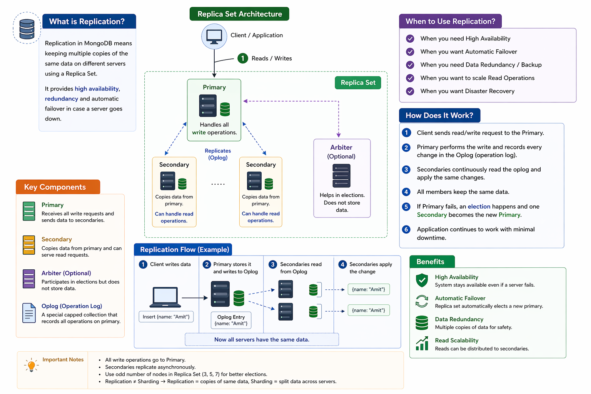

# MongoDB Replication Guide



A comprehensive guide to understanding, implementing, and managing MongoDB Replica Sets for high availability, redundancy, and automatic failover.

## Table of Contents

- [What is Replication?](#what-is-replication)
- [Key Concepts](#key-concepts)
- [Replica Set Architecture](#replica-set-architecture)
- [When to Use Replication](#when-to-use-replication)
- [How Does It Work?](#how-does-it-work)
- [Installation & Setup](#installation--setup)
- [Configuration](#configuration)
- [Best Practices](#best-practices)
- [Monitoring & Maintenance](#monitoring--maintenance)
- [Troubleshooting](#troubleshooting)
- [Benefits](#benefits)

---

## What is Replication?

**Replication in MongoDB** means maintaining multiple copies of the same data on different servers using a Replica Set. This ensures that your database remains accessible and consistent even if one or more servers fail.

### Core Features

- **High Availability** - System continues operating if a server goes down
- **Redundancy** - Multiple data copies provide backup and disaster recovery
- **Automatic Failover** - Elections automatically promote a secondary to primary
- **Data Durability** - Multiple copies reduce data loss risk
- **Read Scalability** - Distribute read operations across secondaries

---

## Key Concepts

### Primary Node
```
├── Receives all write requests
├── Sends data to secondaries
├── Maintains oplog (operation log)
└── Handles all write operations
```

**Responsibilities:**
- Accepts all write operations
- Records every operation in the oplog
- Replicates data to secondary members
- Serves as the source of truth

### Secondary Node(s)
```
├── Copies data from primary
├── Applies oplog changes
├── Can handle read operations
└── Eligible for election
```

**Responsibilities:**
- Continuously read from primary's oplog
- Apply changes asynchronously
- Serve read-only queries (when configured)
- Participate in elections

### Arbiter (Optional)
```
├── Participates in elections only
├── Does NOT store data
├── Minimal resource usage
└── Helps break ties in voting
```

**Use Cases:**
- Odd number of voting members (for tie-breaking)
- Resource-constrained environments
- No storage space needed

### Oplog (Operation Log)
```
├── Capped collection on primary
├── Records all operations
├── Limited size (% of disk)
└── Secondaries read and apply entries
```

**Key Features:**
- Capped collection (fixed size)
- Contains every write operation
- Timestamp-based entries
- Enables point-in-time recovery

---

## Replica Set Architecture

### Typical 3-Node Setup

```
┌─────────────────────────────────────────────────────────────┐
│                    Client Application                        │
│                  (Reads/Writes)                              │
└────────────────────────┬────────────────────────────────────┘
                         │
        ┌────────────────┼────────────────┐
        │                │                │
        ▼                ▼                ▼
    ┌────────┐      ┌────────┐      ┌────────┐
    │ PRIMARY│      │SECONDARY│    │SECONDARY│
    │  Node  │◄────►│  Node   │    │  Node   │
    │(Writes)│      │(Reads)  │    │(Reads)  │
    └────────┘      └────────┘     └────────┘
        │                │              │
        └────────────────┼──────────────┘
                         │
                    Replicates via
                      Oplog (async)
```

### Minimum Deployment

- **3 nodes minimum** for automatic failover
- **5 nodes recommended** for production
- **Odd number of nodes** for better elections

---

## When to Use Replication?

✅ **Use Replication When You Need:**

1. **High Availability**
   - System must stay online 24/7
   - Zero downtime maintenance
   - Service level agreements (SLAs)

2. **Automatic Failover**
   - Automatic recovery from failures
   - No manual intervention needed
   - Self-healing architecture

3. **Data Redundancy & Backup**
   - Multiple data copies
   - Protection against data loss
   - Disaster recovery capabilities

4. **Scaling Read Operations**
   - Distribute read load
   - Improve query performance
   - Handle spike in traffic

5. **Disaster Recovery**
   - Recover from regional outages
   - Geographic distribution
   - Business continuity

---

## How Does It Work?

### Step-by-Step Replication Flow

#### 1️⃣ **Client sends read/write request to Primary**
```javascript
// Client connection
const client = new MongoClient(
  "mongodb://localhost:27017,localhost:27018,localhost:27019"
);
const db = client.db("myapp");

// Write operation goes to Primary
await db.collection("users").insertOne({ 
  name: "Amit", 
  email: "amit@example.com" 
});
```

#### 2️⃣ **Primary performs write and records in oplog**
```
Operation: insert
Collection: users
Document: { name: "Amit", email: "amit@example.com" }
Timestamp: 1713784200
Version: 1
```

#### 3️⃣ **Secondaries continuously read from oplog**
```
Secondary reads oplog entries:
├── Timestamp: 1713784200
├── Operation type: insert
├── Document data
└── Applies changes to local data
```

#### 4️⃣ **Secondaries apply the same changes**
```javascript
// Automatic on secondaries
db.collection("users").insertOne({ 
  name: "Amit", 
  email: "amit@example.com" 
});
```

#### 5️⃣ **Primary fails → Election occurs**
```
Old Primary: DOWN ❌
Secondary 1: Votes for self
Secondary 2: Votes for Secondary 1
Arbiter: Votes for Secondary 1

New Primary: Secondary 1 ✅
```

#### 6️⃣ **Application continues with minimal downtime**
```
Failover time: 5-30 seconds
- Detection time: 10-30s (heartbeat timeout)
- Election time: 1-5s
- Client reconnection: 1-5s
```

---

## Installation & Setup

### Prerequisites

```bash
# System requirements
- MongoDB 4.4+
- Minimum 3 nodes (or 1 primary + 2 arbiters)
- Network connectivity between all nodes
- Same MongoDB version on all nodes
```

### Step 1: Start MongoDB Instances

```bash
# Terminal 1: Primary (port 27017)
mongod --port 27017 --dbpath ./data/primary --replSet "myReplicaSet"

# Terminal 2: Secondary (port 27018)
mongod --port 27018 --dbpath ./data/secondary1 --replSet "myReplicaSet"

# Terminal 3: Secondary (port 27019)
mongod --port 27019 --dbpath ./data/secondary2 --replSet "myReplicaSet"
```

### Step 2: Initialize Replica Set

```bash
# Connect to primary
mongosh mongodb://localhost:27017

# Initialize replica set
rs.initiate({
  _id: "myReplicaSet",
  members: [
    { _id: 0, host: "localhost:27017" },
    { _id: 1, host: "localhost:27018" },
    { _id: 2, host: "localhost:27019" }
  ]
})
```

### Step 3: Verify Configuration

```bash
# Check replica set status
rs.status()

# View configuration
rs.conf()

# Check if current node is primary
db.isMaster()
```

---

## Configuration

### Basic Configuration Example

```javascript
// Configuration object
const config = {
  _id: "myReplicaSet",
  version: 1,
  members: [
    {
      _id: 0,
      host: "server1.example.com:27017",
      priority: 2,
      votes: 1
    },
    {
      _id: 1,
      host: "server2.example.com:27017",
      priority: 1,
      votes: 1
    },
    {
      _id: 2,
      host: "server3.example.com:27017",
      priority: 0,
      votes: 0,
      hidden: true
    },
    {
      _id: 3,
      host: "arbiter.example.com:27017",
      arbiterOnly: true
    }
  ],
  settings: {
    heartbeatIntervalMillis: 10000,
    heartbeatTimeoutSecs: 30,
    electionTimeoutMillis: 10000,
    getLastErrorDefaults: { w: "majority", wtimeout: 5000 }
  }
};

// Apply configuration
rs.reconfig(config);
```

### Key Configuration Parameters

| Parameter | Description | Default |
|-----------|-------------|---------|
| `priority` | Election priority (0-100) | 1 |
| `votes` | Participation in elections (0-1) | 1 |
| `hidden` | Not returned in isMaster (0-1) | 0 |
| `slaveDelay` | Seconds behind primary | 0 |
| `arbiterOnly` | Arbiter node only (true/false) | false |

---

## Application Connection

### Connect with Node.js

```javascript
const { MongoClient } = require("mongodb");

const uri = "mongodb://localhost:27017,localhost:27018,localhost:27019/?replicaSet=myReplicaSet";

const client = new MongoClient(uri, {
  replicaSet: "myReplicaSet",
  w: "majority",
  wtimeout: 5000,
  readPreference: "primary"
});

async function connectAndInsert() {
  try {
    await client.connect();
    
    const db = client.db("myapp");
    const collection = db.collection("users");
    
    // Write operation
    const result = await collection.insertOne({ 
      name: "Amit",
      email: "amit@example.com",
      createdAt: new Date()
    });
    
    console.log("Inserted:", result.insertedId);
    
    // Read operation (from primary)
    const user = await collection.findOne({ name: "Amit" });
    console.log("Found:", user);
    
  } finally {
    await client.close();
  }
}

connectAndInsert();
```

### Read Preferences

```javascript
// Read from primary (default)
const primaryRead = collection.find({}, { 
  readPreference: "primary" 
});

// Read from secondary (for reporting)
const secondaryRead = collection.find({}, { 
  readPreference: "secondary" 
});

// Read from nearest node (lowest latency)
const nearestRead = collection.find({}, { 
  readPreference: "nearest" 
});

// Read from primary preferred
const primaryPreferred = collection.find({}, { 
  readPreference: "primaryPreferred" 
});
```

---

## Best Practices

### 1. Deployment Topology

```bash
✅ Production Setup (3+ nodes)
├── Primary: Full read/write capability
├── Secondary 1: Full replica
└── Secondary 2: Full replica

✅ Cost-Optimized Setup (3+ nodes)
├── Primary: Full replica
├── Secondary: Full replica
└── Arbiter: Election only (minimal resources)

❌ Avoid: Single node (no failover)
❌ Avoid: Even number of nodes (election ties)
```

### 2. Write Concern Configuration

```javascript
// Majority write concern (recommended)
await collection.insertOne(
  { name: "Amit" },
  { writeConcern: { w: "majority", j: true, wtimeout: 5000 } }
);

// Breakdown:
// w: "majority" → Acknowledged by majority of nodes
// j: true → Journaled to disk
// wtimeout: 5000 → Wait max 5000ms for acknowledgment
```

### 3. Read Concern Levels

```javascript
// Available (default)
collection.find({}, { readConcern: { level: "available" } });

// Local
collection.find({}, { readConcern: { level: "local" } });

// Majority (most consistent)
collection.find({}, { readConcern: { level: "majority" } });

// Snapshot (requires majority read concern enabled)
collection.find({}, { readConcern: { level: "snapshot" } });
```

### 4. Oplog Size Management

```javascript
// Check current oplog size
use local
db.oplog.rs.stats().size

// Increase oplog size (requires downtime)
// Stop all secondary members first
// Then reconfigure on primary

// Recommended: 5-10% of disk space
```

### 5. Monitor and Alert

```javascript
// Check replication lag
rs.status().members.map(member => ({
  host: member.host,
  state: member.state,
  optime: member.optime,
  lag: member.lastHeartbeat - member.lastHeartbeatRecv
}));

// Set up monitoring for:
// - Replication lag > 10 seconds
// - Primary failover events
// - Oplog window < 24 hours
```

---

## Monitoring & Maintenance

### Key Metrics to Monitor

```javascript
// 1. Replication Lag
db.adminCommand("replSetGetStatus").members.forEach(m => {
  if (m.state === 2) { // Secondary
    console.log(`${m.name}: Lag = ${m.optimeDate - m.lastApplied}ms`);
  }
});

// 2. Oplog Window
const oplogStats = db.oplog.rs.stats();
const frontTS = db.oplog.rs.find().sort({ $natural: 1 }).limit(1)[0].ts;
const backTS = db.oplog.rs.find().sort({ $natural: -1 }).limit(1)[0].ts;
console.log(`Oplog window: ${backTS.t - frontTS.t} seconds`);

// 3. Member Health
rs.status().members.forEach(m => {
  console.log(`${m.name}: ${m.health === 1 ? "✓ HEALTHY" : "✗ DOWN"}`);
});
```

### Maintenance Tasks

```bash
# Rolling restart (no downtime)
# 1. Restart all secondaries one by one
mongod --shutdown
mongod --port 27017 --dbpath ./data --replSet "myReplicaSet"

# 2. Step down primary
rs.stepDown()

# 3. Wait for election to complete
# Check with rs.status()

# 4. Restart old primary
mongod --port 27017 --dbpath ./data --replSet "myReplicaSet"
```

---

## Troubleshooting

### Issue: Secondary Not Syncing

```javascript
// Diagnose
rs.status()
// Look for members with state: 8 (down) or state: 10 (unknown)

// Solutions
rs.syncFrom("server1:27017")  // Manual sync
rs.resync()                    // Full resync
db.adminCommand({ replSetResync: 1 })
```

### Issue: Replication Lag Too High

```javascript
// Check oplog window
db.oplog.rs.stats().size

// Check network connectivity
ping server1
ping server2

// Reduce write load
// Optimize queries
// Add more secondary capacity
```

### Issue: Election Stuck

```javascript
// Force new primary
rs.stepDown()

// Or explicitly elect
rs.freeze(60)  // Prevent elections for 60s
rs.reconfig(newConfig, {force: true})
```

### Issue: Cannot Connect to Replica Set

```javascript
// Verify all nodes are running
ps aux | grep mongod

// Check ports are accessible
nc -zv localhost 27017

// Verify replica set status
mongosh mongodb://localhost:27017 --eval "rs.status()"

// Check firewall rules
sudo iptables -L
```

---

## Benefits

### 🎯 High Availability
- System remains operational during node failures
- Automatic failover in 5-30 seconds
- Zero manual intervention required

### 🔄 Automatic Failover
- Replica set automatically elects new primary
- Clients automatically redirect to new primary
- No data loss with proper write concern

### 💾 Data Redundancy
- Multiple copies of data
- Protection against hardware failure
- Point-in-time recovery capability

### 📊 Read Scalability
- Distribute read load across secondaries
- Improve query performance
- Handle spike in traffic without overloading primary

### 🌍 Disaster Recovery
- Geographical distribution possible
- Backup for data protection
- Quick recovery from regional outages

---

## Performance Considerations

### Oplog Space Requirements

```
Oplog Size Formula:
Oplog Size = Disk Space * Percentage (typically 5%)

Examples:
- 1TB disk → ~50GB oplog window
- 100GB disk → ~5GB oplog window

Oplog Window = Oplog Size / Average Write Rate (bytes/sec)
```

### Network Bandwidth

```
Bandwidth requirements depend on:
- Write throughput (ops/sec)
- Document size (bytes)
- Number of secondaries

Formula:
Bandwidth = Write throughput * Average doc size * Number of secondaries
```

### CPU & Memory Usage

```
Primary:   High (processes writes)
Secondary: Medium (applies writes from oplog)
Arbiter:   Low (election only)
```

---

## Additional Resources

- [MongoDB Replication Documentation](https://docs.mongodb.com/manual/replication/)
- [Replica Set Configuration](https://docs.mongodb.com/manual/reference/replica-configuration/)
- [Write Concern](https://docs.mongodb.com/manual/reference/write-concern/)
- [Read Preference](https://docs.mongodb.com/manual/core/read-preference/)

---

## License

This guide is provided as-is for educational and reference purposes.

## Contributing

Found an issue or have suggestions? Feel free to open an issue or submit a pull request!

---
